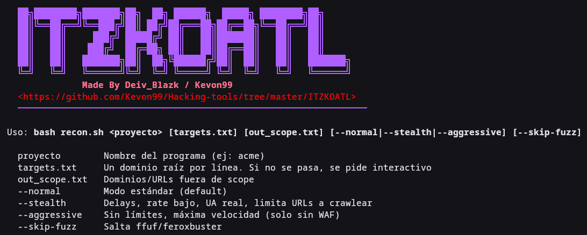

# ITZKOATL — Obsidian Recon Engine

**ITZKOATL** (Nahuatl: "Obsidian Serpent") is a high-performance automated reconnaissance pipeline designed for bug bounty hunters and security consultants. It intelligently triages and prioritizes, filtering noise to focus on high-impact surfaces.




---

## Overview

ITZKOATL integrates multiple open-source reconnaissance tools into a cohesive workflow, adding intelligent scoring, WAF-aware steering, and focused fuzzing. Rather than blindly scanning everything, it ranks endpoints by risk profile and directs follow-up actions only where they matter most.

---

##  Key Features

- **Parallel Subdomain Discovery**: Runs `subfinder`, `assetfinder`, and `amass` concurrently for maximum coverage speed.
- **M7 Intelligent Scoring (Python engine)**: Classifies every discovered endpoint into one of three tiers:
  - **High Priority** — endpoints with parameters, interesting patterns, or known vulnerability markers.
  - **IDOR Candidates** — routes that may be vulnerable to Insecure Direct Object Reference issues.
  - **API Endpoints** — JSON/REST endpoints worthy of deeper analysis.
- **WAF-Aware Execution**: Built-in `wafw00f` detection that automatically suggests **Stealth Mode** to reduce IP ban risk.
- **Focused Fuzzing**: Only runs content discovery (`ffuf` / `feroxbuster`) on high-scoring targets, preserving bandwidth and time.
- **Multi-Mode Logic**: Switch between `--stealth`, `--normal`, and `--aggressive` depending on target scope and engagement rules.
- **Modular Output**: Structured JSON/CSV reports for integration with other tooling (e.g., nuclei, dalfox, custom triage pipelines).

---

## Requirements & Dependencies

| Dependency | Minimum Version | Purpose |
|------------|----------------|---------|
| Python | 3.9+ | Scoring engine (M7) |
| Bash | — | Entry point script |
| subfinder | latest | Subdomain enumeration |
| assetfinder | latest | Subdomain enumeration |
| amass | latest | Subdomain enumeration & brute-forcing |
| wafw00f | latest | WAF detection |
| ffuf | latest | HTTP fuzzing/content discovery |
| feroxbuster | latest | Alternative content discovery |
| httpx | latest | HTTP client for status/redirect checks |
| nuclei | latest | Vulnerability templating (optional) |

**OS**: Linux / macOS (WSL2 acceptable). Windows not supported natively.

---

##  Installation

```bash
git clone https://github.com/Kevon99/Hacking-tools/ && cd Hacking-tools/ITZKOATL
chmod +x itzkoatl.sh
```

Ensure all dependencies are installed via your package manager or `go install`, `pip install`, or manual binary placement.

---

## 💡 Usage

### Basic Syntax

```bash
bash itzkoatl.sh <project_name> [targets.txt] [out_scope.txt] [--mode]
```

### Mode Flags

| Flag | Description |
|------|-------------|
| `--stealth` | Enables WAF-aware delays, reduced concurrency, and selective scanning. |
| `--normal` | Balanced speed and stealth (default). |
| `--aggressive` | Max concurrency, full scanning — use only with authorization and large IP ranges. |

### Example Workflows

```bash
# Standard engagement with wordlist
bash itzkoatl.sh myproject targets.txt out_scope.txt --normal

# Stealth mode for a large bug bounty scope
bash itzkoatl.sh stealth_run targets.txt out_scope.txt --stealth

# Aggressive mode against a small, authorized target
bash itzkoatl.sh aggressive_test target.txt out_scope.txt --aggressive
```

### Input Files

- **`targets.txt`** — One domain or IP per line (primary scope).
- **`out_scope.txt`** — Additional domains/IPs to include beyond `targets.txt` (e.g., disclosed subdomains, third-party surfaces).

---

## 📊 How It Works (Internal Flow)

1. **Subdomain Enumeration** — `subfinder`, `assetfinder`, and `amass` run in parallel; results are deduped and deconflicted.
2. **HTTP Probing** — `httpx` validates live hosts, extracts titles, technologies, and status codes.
3. **WAF Detection** — `wafw00f` runs on each live host; if a WAF is identified, the host is flagged for steering.
4. **M7 Scoring** — Python engine analyzes each endpoint:
   - Presence of query parameters
   - Known sensitive patterns (IDs, tokens, API routes)
   - Response size/content entropy
   - assigns a risk tier (High Priority / IDOR Candidate / API)
5. **Focused Fuzzing** — Only high-scoring targets are passed to `ffuf`/`feroxbuster` for content discovery.
6. **Reporting** — Structured output (JSON/CSV) with triage-ready classifications and raw URLs for each category.

---

## ⚠️ Limitations

- Scoring is heuristic-based; false positives/negatives are possible. Manual verification is always required.
- WAF detection may miss sophisticated or custom WAFs.
- Parallel subdomain enumeration can generate significant DNS traffic — respect rate limits and scope boundaries.
- `--aggressive` mode may trigger rate limits or WAF blocks on poorly managed targets.
- No authentication support built-in — protected routes must be tested separately.
- Output quality depends on the accuracy and completeness of the underlying tools (subfinder, amass, etc.).

---

## 🌍 Ethical & Responsible Use

This tool is **intended solely for educational and authorized security testing purposes**. You must obtain explicit, written permission before scanning any target you do not own or have a formal engagement for. The author assumes no liability for misuse, legal consequences, or damage arising from improper use.

Always adhere to your organization's bug bounty program rules, scope definitions, and applicable laws (e.g., CFAA, GDPR). Use responsibly.

---

## 📄 License

MIT License. See `LICENSE` for full text.

---

## 🙏 Acknowledgments

- Project name and Nahuatl translation inspired by Mexican cybersecurity culture.
- Built upon the shoulders of `subfinder`, `assetfinder`, `amass`, `httpx`, `wafw00f`, `ffuf`, and `nuclei`.
